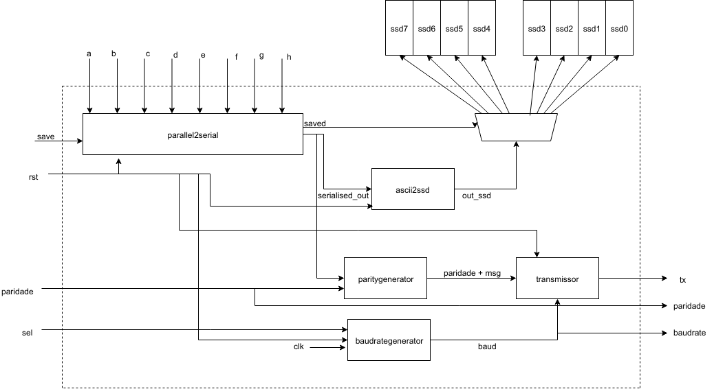

# IFSC - Instituto Federal De Santa Catarina 
#### Aluno: Suyan M. V. Moura. 

# Projeto final de DLP-1 - Transmissor/Receptor Serial:

* Este projeto possuirá dois circuitos fundamentais, um responsável por enviar dados e outro responsável por receber. 
* Ele possuirá dois modos de funcionamento: 
  * Debug: usará 4 displays para mostrar a mensagem a ser enviada e mais 4 displays ssd para mostrar a mensagem recebida, neste modo é possível conectar a saída serial na entrada serial da propria placa. 
  * Normal: Usará 8 displays para mostrar a mensagem a ser enviada ou a mensagem a ser recebida. 

## Transmissor

### Requisitos funcionais: 

* Deverá receber uma entrada paralela e converte-la para serial. 
* Deverá imprimir em displays de 7 segmentos a mensagem a ser enviada. 
* A mensagem deverá ser transmitida por uma saída serial. 
* Usuário poderá definir o baudrate do sistema.
* Dentre as taxas de baud, ao menos uma deve ser comercial.
* Dentre as taxas de baud, ao menos uma deverá ser "lenta o suficiente para poder ver a mensagem sendo transmitida". 
* Deverá ter uma saída para o baudrate usado para transmistir a mensagem. 
* Usuário poderá definir a paridade do sistema (par ou impar).
* Deverá ser capaz de informar a paridade escolhida pelo usuário. 
* A mensagem a ser transmitida terá 1 bit de start, 1 de paridade, 7 de dados propriamente ditos e, por fim, 2 bits de stop.
* Cada mensagem enviada será apenas um caractere ASCII.   

### Funcionamento:

* Usuário, por meio de chaves, seleciona os bits da mensagem. 
* Ao pressionar o botão "Save", os bits serão salvos, e iniciará a transmissão. 
* Quando os bits estiverem salvos. O sistema tentará converte-los de ASCII para SSD, e os imprimirá no Display.  
* Ou seja, caso deseje-se digitar "balao", deverá, portanto, digitar: 

    **1000010**, save, **1000001**, save, **1001100**, save, 
    **1000001**, save, **1001111** e save. 

* Usuário definirá a paridade do sistema através de uma chave, 0 par, 1 impar. 
* Usar-se-á duas chaves para o baudrate
    
    00 = 1bps 
    01 = 4bps 
    10 = 8bps 
    11 = 9600 bps

* Enquanto estiver a transmistir mensagens, acenderá um led indicando o status de transmissão. 

## Receptor: 

### Requisitos funcionais: 

* Recebe mensagens seriais e as converte para paralelo. 
* Também converte a mensagem recebida para SSD, e as imprime no display de 7 segmentos. 
* Deverá ter um detector de paridade. 
* Quando estiver a receber mensagens, acenderá um led, para indiciar o status de recebimento. 
  

O diagrama a seguir representa de forma superficial, o circuito a ser implementado.

