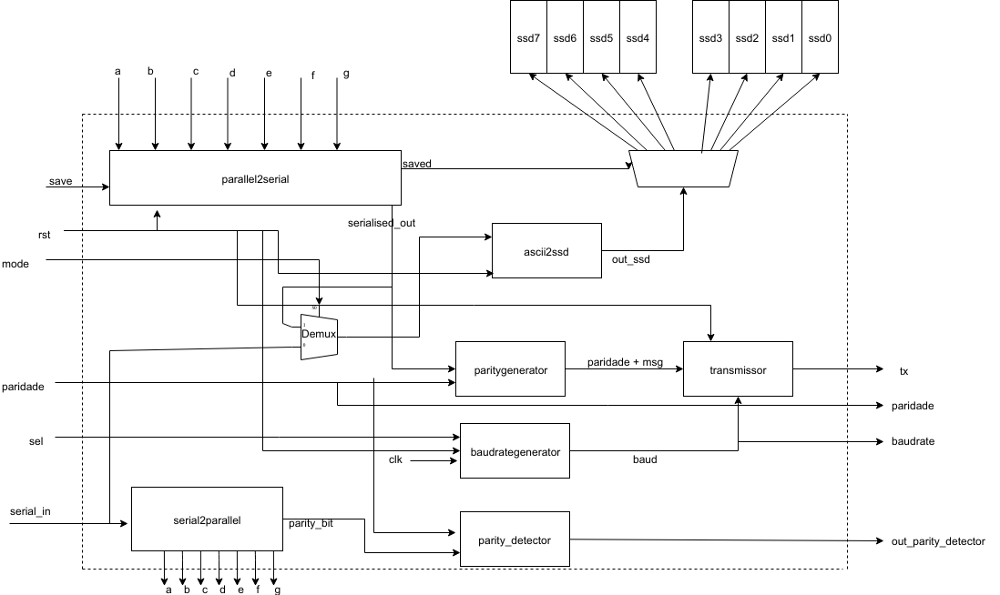

# IFSC - Instituto Federal De Santa Catarina 
### Aluno: Suyan M. V. Moura. 

## Descrição do Sistema: 
* Usuário, por meio de chaves, seleciona os bits, que definirão a mensagem. 
* Ao pressionar o botão "Save", os bits serão salvos. 
* Quando os bits estiverem salvos. O sistema tentará converte-los de ASCII para SSD, e os imprimirá no Display. 
* Para cada display deverá seguir o procedimento descrito anteriormente. 
* Ou seja, caso deseje-se digitar "balao", deverá, portanto, digitar: 

    **1000010**, save, **1000001**, save, **1001100**, save, 
    **1000001**, save, **1001111** e save. 

* Transmissão de dados dependerá da taxa de Baudrate. 

* Haverá uma chave para escolher a paridade (0 par e 1 impar)

* Haverá um clock compartilhado entre o módulo transmissor e receptor.

* Usa-se duas chaves para o baudrate
    
    00 = 1bps 
    01 = 4bps 
    10 = 8bps 
    11 = 9600 bps

* A mensagem a ser transmitida terá 1 bit de start,8 de dados, 1 de paridade e 1 de stop.

## Diagrama 

O diagrama a seguir representa de forma superficial, o circuito a ser implementado. 

